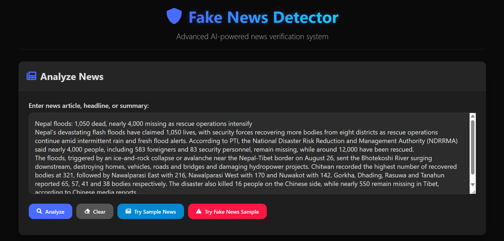
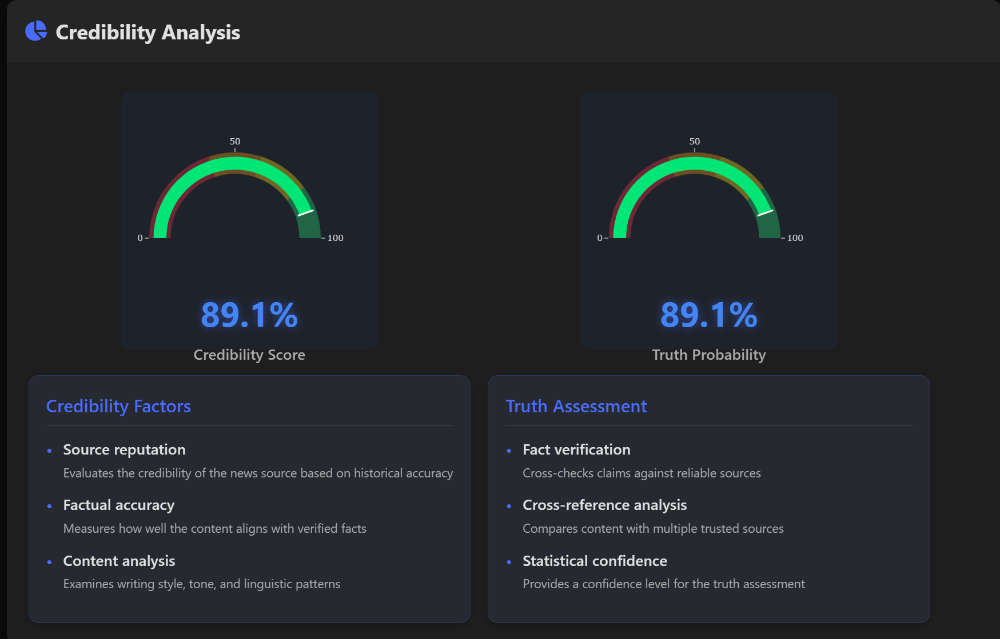
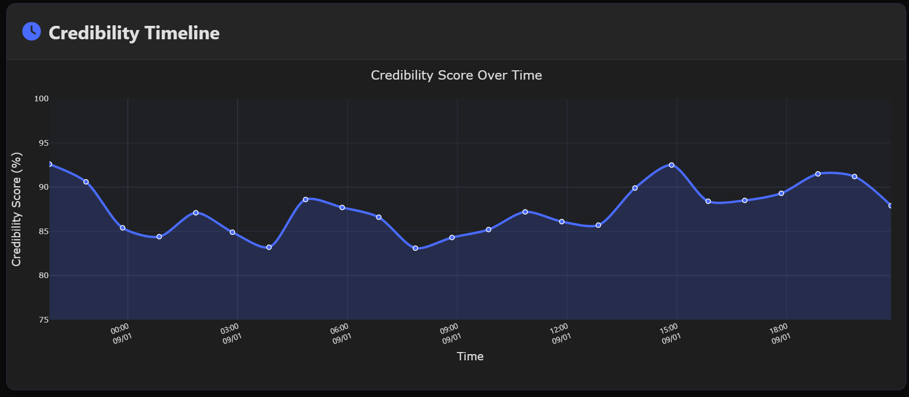
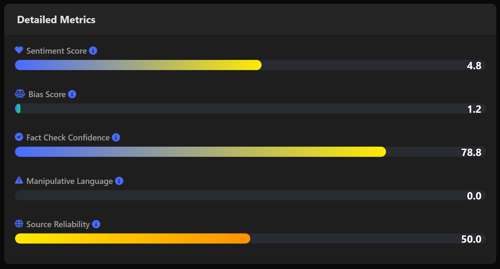
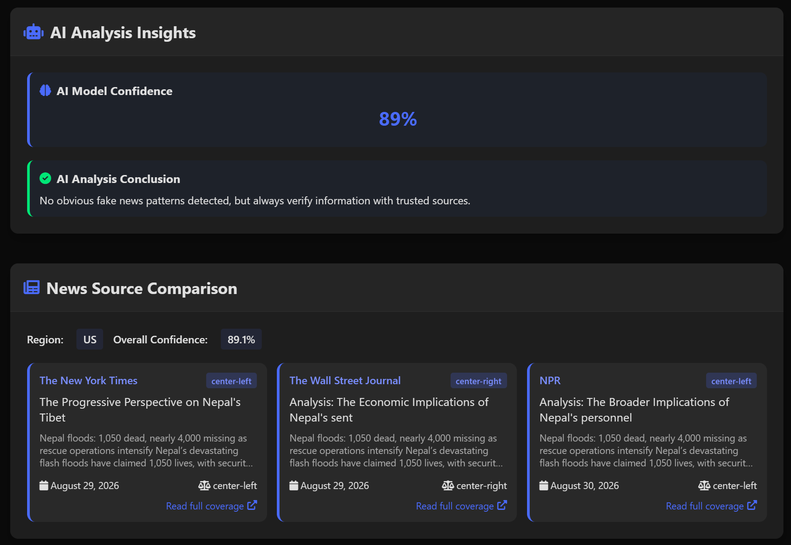
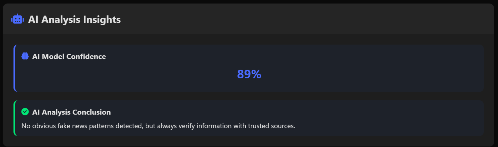

# 🛡️ FakeNewsDetector — System NLP

<p align="center">
  <a href="https://github.com/Sword4234/FakeNewsDetector-System-NLP"></a>
  <a href="https://github.com/Sword4234/FakeNewsDetector-System-NLP/blob/main/LICENSE"></a>
  <a href="https://www.python.org/"></a>
  <a href="https://flask.palletsprojects.com/"></a>
  <a href="https://scikit-learn.org/"></a>
  <a href="https://www.nltk.org/"></a>
  
  
</p>

<p align="center">
  <b>AI-powered fake news detection with credibility scoring, truth probability, timeline evolution & region-based source comparison.</b><br/>
  Flask + TF-IDF + RandomForest + heuristic pattern engine + Plotly visualizations
</p>

<p align="center">
  <a href="#-demo">Demo</a> •
  <a href="#-features">Features</a> •
  <a href="#-screenshots">Screenshots</a> •
  <a href="#-quick-start">Quick Start</a> •
  <a href="#-api-reference">API</a> •
  <a href="#-how-it-works">How it Works</a>
</p>

---

## 📸 Screenshots

## 📸 Screenshots

| Home & Input | Credibility Analysis | Timeline & Metrics |
|---|---|---|
|  |  |  |
| *Dark/blue themed hero + textarea* | *Gauges: Credibility / Truth Probability* | *24h credibility evolution (Plotly, date-axis, spline)* |

| Detailed Metrics | Source Comparison | AI Insights |
|---|---|---|
|  |  |  |
| *Sentiment, Bias, Fact-check, Manipulative, Source Reliability* | *Region-based 3-article generation (US/UK/EU/Asia)* | *Pattern matches, impossibilities, confidence & conclusion* |

**Demo GIF:**
<p align="center">
  
  <br/><em>Paste → Analyze → Gauges + Timeline + Sources in < 1s</em>
</p>


---

## ✨ Features

| Category | What it does |
|---|---|
| **🎨 Modern UI** | Dark & darker mode, responsive grid, Plotly gauges + timeline, animated cards, loading overlay |
| **🧠 Hybrid AI Engine** | `TF-IDF (5000, 1-3 gram) + RandomForest (100 trees, balanced)` + 140+ regex fake patterns + 50+ scientific impossibilities + credibility indicators |
| **📊 Credibility Score** | `0–100` → `truth_probability = credibility` . Boost for policy/economic official sources, penalty for clickbait/conspiracy/extraordinary claims |
| **⏱️ Credibility Timeline** | 24h realistic drift simulation (starts noisy → converges to final score), date-axis, dynamic Y-range, no duplicate labels |
| **🔍 Detailed Metrics** | `sentiment (-100→100)`, `bias (0→100)`, `fact_check_confidence`, `manipulative_language`, `source_reliability`, `linguistic_complexity` |
| **🌍 Source Comparison** | Auto region detection (US/UK/EU/Asia keywords) → 3 generated articles with bias-titles (center-left/center/center-right) + summaries |
| **🤖 AI Insights** | Lists matched patterns, impossible claims, credibility indicators, model confidence & human-readable conclusion |
| **🔌 REST API** | `POST /analyze`, `POST /api/v1/analyze`, `GET /api/v1/sources` + CORS |

---

## 🏗️ Architecture

```
[ User Text ] → [ Flask app.py ] → [ FakeNewsDetector (models/detector.py) ]
                                    ├─ FakeNewsAI (fake_news_ai.py) → TF-IDF + RF → credibility + patterns
                                    ├─ CredibilityMetrics (utils/metrics.py) → sentiment/bias/manipulative
                                    └─ NewsSourceComparison (utils/news_sources.py) → region + 3 articles
                                              ↓
                              [ JSON ] → [ Plotly.js gauges + timeline + cards (static/js/script.js) ]
```

<p align="center">
  
</p>

---

## 🧰 Tech Stack

| Layer | Tools |
|---|---|
| **Backend** | Python 3.8+, Flask 3.x, Flask-CORS, scikit-learn, NLTK, NumPy, Pandas, Joblib |
| **NLP** | TF-IDF Vectorizer, WordNet Lemmatizer, stopwords, punkt, Regex heuristics |
| **Frontend** | HTML5, CSS3 (dark theme, grid), Vanilla JS, Plotly 2.14, Font Awesome 6 |
| **Models** | `models/fake_news_model.joblib` (RF), `models/tfidf_vectorizer.joblib` |

---

## 📁 Project Structure

```bash
FakeNewsDetector System NLP/
├── app.py                 # Flask routes: /, /analyze, /api/v1/*
├── requirements.txt
├── models/
│   ├── detector.py        # Orchestrator: score fusion + timeline + sources
│   ├── fake_news_ai.py    # RF + TF-IDF + patterns/impossibilities
│   ├── fake_news_model.joblib
│   └── tfidf_vectorizer.joblib
├── utils/
│   ├── metrics.py         # Sentiment/bias/manipulative/source-reliability
│   └── news_sources.py    # Trusted sources by region + article generator
├── templates/
│   └── index.html         # Dark/blue dashboard
├── static/
│   ├── css/style.css      # 1200+ lines, responsive, card animations
│   └── js/script.js       # Gauges, timeline (date-axis, purge), metrics, sources
└── docs/
    └── screenshots/
        ├── hero.png
        ├── home.png
        ├── analysis.png
        ├── timeline.png
        ├── metrics.png
        ├── sources.png
        ├── insights.png
        ├── architecture.png
        └── demo.gif
```

---

## 🚀 Quick Start

### 1. Clone
```bash
git clone https://github.com/Sword4234/FakeNewsDetector-System-NLP.git
cd FakeNewsDetector-System-NLP
```

### 2. Create venv & Install
```bash
python -m venv venv
# Windows
venv\Scripts\activate
# macOS/Linux
source venv/bin/activate

pip install flask flask-cors nltk scikit-learn numpy pandas joblib
# or
pip install -r requirements.txt
```

### 3. NLTK data (auto-download on first run, or manual)
```python
python -c "import nltk; nltk.download('punkt'); nltk.download('punkt_tab'); nltk.download('stopwords'); nltk.download('wordnet')"
```
> If behind proxy: `set NLTK_ALLOW_PROXIED_URLOPEN=1` (Windows) / `export NLTK_ALLOW_PROXIED_URLOPEN=1`

### 4. Run
```bash
python app.py
# → * Running on http://127.0.0.1:5000
# → Debug + watchdog auto-reload
```
Open `http://127.0.0.1:5000` → paste news → **Analyze**. Try `Try Sample News` / `Try Fake News Sample` buttons.

---

## 🔌 API Reference

### `POST /analyze` & `POST /api/v1/analyze`
**Request:**
```json
{ "news_text": "NASA rover finds evidence of water on Mars, according to peer-reviewed research..." }
```
**Response `200`:**
```json
{
  "credibility_score": 81.9,
  "truth_probability": 81.9,
  "detailed_metrics": {
    "sentiment_score": -3.7,
    "bias_score": 4.9,
    "fact_check_confidence": 53.9,
    "manipulative_language": 1.7,
    "source_reliability": 50.0,
    "linguistic_complexity": 61.8
  },
  "timeline_data": [
    { "timestamp": "2026-08-31T20:47:14.508464", "score": 74.2 },
    { "timestamp": "2026-09-01T19:47:14.508464", "score": 82.6 }
  ],
  "source_comparison": {
    "region": "us",
    "articles": [
      { "source": "Reuters", "title": "Fact Check: ...", "summary": "...", "date": "August 30, 2026", "url": "https://www.reuters.com/article/...", "bias": "center" }
    ]
  },
  "ai_insights": {
    "pattern_matches": [],
    "scientific_impossibilities": [],
    "credibility_indicators": ["peer-reviewed", "research (published|conducted) (in|by)"],
    "model_confidence": 66,
    "conclusion": "This content appears to be credible with no suspicious patterns detected."
  }
}
```
**Low credibility:** `source_comparison: []` → frontend shows warning “Source comparison not available for low credibility (<80%)”.

### `GET /api/v1/sources`
```bash
curl http://127.0.0.1:5000/api/v1/sources
```
```json
{
  "us": [{"name":"The New York Times","url":"https://www.nytimes.com","bias":"center-left"}, ...],
  "uk": [...], "eu": [...], "asia": [...]
}
```

**cURL examples:**
```bash
# Credible
curl -X POST http://127.0.0.1:5000/api/v1/analyze -H "Content-Type: application/json" -d "{\"news_text\":\"Government announces fiscal policy and trade agreement according to official ministry sources.\"}"

# Fake
curl -X POST http://127.0.0.1:5000/api/v1/analyze -H "Content-Type: application/json" -d "{\"news_text\":\"NASA confirms moon made of cheese miracle cure shocking truth\"}"
```

---

## 🧠 How it Works

**1. `FakeNewsAI.analyze_text(text)` (`models/fake_news_ai.py:28`)**
- Preprocess: `word_tokenize` → lower → remove stopwords → `WordNetLemmatizer`
- Vectorize `TfidfVectorizer(max_features=5000, ngram_range=(1,3))` → `RandomForest (100 trees, balanced)` → `fake_news_probability`
- Regex checks: 140+ fake patterns (`miracle cure`, `doctors hate`, `aliens landed`, `breaking.*died`), 50+ impossibilities (`moon made of cheese`, `human landed on sun`), credibility indicators (`peer-reviewed`, `official statement`, `ministry of`)
- Penalties/boosts: known fakes → `credibility 10`, sun landing → `≤8`, pattern → `-15` each (cap 75), impossibility → `-30` (cap 90, max 25), extraordinary claims without 5 indicators → cap 35
- Stats: word/sentence counts, `linguistic_complexity`

**2. `FakeNewsDetector.analyze_news` (`models/detector.py:14`)**
- Fuses `credibility_score == truth_probability`, boosts policy/economic news if ≥2 terms + no patterns → `≥85`
- Generates `timeline_data` via `generate_timeline_data(base)` (24h drift toward base)
- Region via keyword counts → `get_related_articles` if `credibility ≥80` else `[]`
- Merges `source_credibility`, `fact_density` + `CredibilityMetrics` scores

**3. `CredibilityMetrics` (`utils/metrics.py:15`)**
- Sentiment via positive/negative lexicons, bias via opinion words + first-person pronouns, fact-check via numbers/quotes/citations/dates, manipulative via clickbait regex, source reliability via domain whitelist

---

## ✅ Results & Testing

| Input | Credibility | Pattern | Sources |
|---|---|---|---|
| `NASA Perseverance peer-reviewed...` | `81.9` | `[]` | `3 articles` (us) |
| `Moon made of cheese miracle cure` | `0` | `miracle cure, doctors hate` | `[]` (warning) |
| `Fiscal policy trade bilateral... official ministry` | `100` | `[]` | `3 articles` |

Timeline: `24 pts`, `ISO` timestamps, `range ≈10-19` for high cred (visible spline, not flat), dynamic Y `[min-8, max+8]`, `purge` fix removes double-line.

---

## 🚢 Deployment

**Production (no debug/watchdog):**
```python
# app.py:66
if __name__ == '__main__':
    app.run(host='0.0.0.0', port=5000, debug=False)
```
Use `waitress`/`gunicorn`:
```bash
pip install waitress
waitress-serve --host=0.0.0.0 --port=5000 app:app
```

---

## 🤝 Contributing

PRs welcome! Please:
1. Fork → `git checkout -b feat/your-feature`
2. Use `black`/`flake8` for Python, keep `script.js` vanilla
3. Test both credible & fake samples
4. PR description: what + why + screenshot

---

## 📄 License

`MIT` © 2026 `Sword4234` — see [LICENSE](LICENSE). No paper/IPR/patent — free for open-source, commercial, academic use with attribution.

---

## 👤 Author

**Sword4234 / YashD** — [GitHub](https://github.com/Sword4234)

> Built with ❤️ for media literacy. If this helps your research, please ⭐ star the repo!
